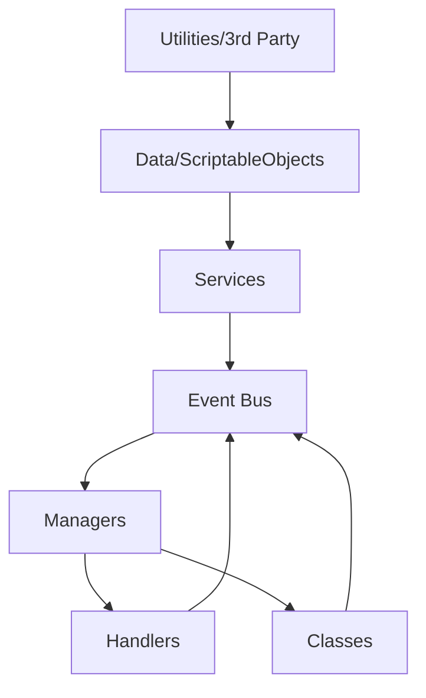

# Code Architecture

This document outlines the architectural design patterns for Unity projects using the Capriccioso Starter Package.

---

## Core Layers

```
┌─────────────────────────────────────────────────────────────┐
│                    Layer Hierarchy                          │
├─────────────────────────────────────────────────────────────┤
│  A. Utilities / 3rd Party Libraries                         │
│       ↓                                                     │
│  B. Data Containers (ScriptableObjects)                     │
│       ↓                                                     │
│  C. Services (MonoSingleton / ServiceLocator)               │
│       ↓                                                     │
│  D. Event Bus (Central Communication)                       │
│       ↓                                                     │
│  E. Managers (State Coordination)                           │
│       ↓                                                     │
│  F. Handlers / Classes (Leaf Nodes)                         │
└─────────────────────────────────────────────────────────────┘
```

---

## Layer Details

### A. Utilities / 3rd Party Libraries
**Access:** Global  
**Purpose:** Reusable tools and external libraries

**Examples:**
- JSON serializers
- Math utilities
- Extension methods

**Rules:**
- Must contain zero game logic
- Stateless implementations only

---

### B. Data Containers / ScriptableObjects
**Access:** Services layer only  
**Purpose:** Data storage and asset management

**Examples:**
- Configuration assets
- Item definitions
- Audio/visual references

**Rules:**
- Pure data (no behavior/methods beyond getters)
- No direct access from Handlers

---

### C. Services
**Access:** Event Bus, Managers, Handlers  
**Implementation:** `MonoSingleton` or `ServiceLocator`  
**Purpose:** Stateless infrastructure logic

**Examples:**
- `AudioService`
- `AnalyticsService`
- `PoolService`

**Rules:**
- ✅ Stateless operations
- ✅ Singleton access point
- ❌ No inspector references
- ❌ Never call Managers/Handlers directly

---

### D. Event Bus
**Access:** All layers (primary communication channel)  
**Purpose:** Decoupled event messaging

**Examples:**
- `PlayerDiedEvent`
- `ScoreChangedEvent`
- `LevelCompleteEvent`

**Rules:**
- Events are structs (zero-allocation)
- Handlers **publish** events
- Managers **subscribe** to events
- Avoid complex payloads

---

### E. Managers
**Access:** Handlers → Managers (never reverse)  
**Implementation:** `MonoSingleton` MonoBehaviours  
**Purpose:** State coordination across systems

**Examples:**
- `UIManager`
- `GameManager`
- `AudioManager`

**Rules:**
- May reference Handlers
- Never call Services directly (use Events when possible)
- Orchestrate game state

---

### F. Handlers
**Access:** Called by Managers  
**Implementation:** MonoBehaviours with inspector references  
**Purpose:** Visual/audio element controllers

**Examples:**
- `InventoryHandler` (UI panels)
- `PlayerMovementHandler`
- `AudioHandler`

**Rules:**
- ❌ No business logic
- ✅ Inspector-configurable
- Publish events, don't subscribe cross-system

---

### G. Classes
**Access:** Similar to Handlers  
**Purpose:** Data containers and pure logic

**Examples:**
- `PlayerStats`
- `InventoryItem`
- Data models

**Rules:**
- Minimal Unity dependencies
- Serializable data structures

---

## Access Flow



---

## Access Rules Matrix

| From | To | Method | Allowed |
|------|-----|--------|---------|
| Handler | Manager | Events | ❌ Forbidden |
| Handler | Service | ServiceLocator | ✅ Allowed |
| Handler | ScriptableObject | Direct field | ✅ Allowed |
| Manager | Service | ServiceLocator | ✅ Allowed |
| Manager | Manager | Events (preferred) | ✅ Allowed |
| Service | Manager | — | ❌ Forbidden |
| Service | Handler | — | ❌ Forbidden |

---

## Prohibited Patterns

```csharp
// ❌ BAD — Service calling Manager
public class AchievementService : MonoSingleton<AchievementService> 
{
    public void GrantAchievement() 
    {
        UIManager.Instance.ShowPopup(); // ILLEGAL
    }
}

// ✅ GOOD — Using Event Bus
public class AchievementService : MonoSingleton<AchievementService>
{
    public void GrantAchievement()
    {
        EventBus.Publish(new AchievementUnlockedEvent());
    }
}
```

---

## Core Patterns

This package provides four fundamental patterns:

### 1. ServiceLocator
Interface-based dependency injection without frameworks.

```csharp
// Register
ServiceLocator.Register<IAudioService>(audioService);

// Retrieve
var audio = ServiceLocator.Get<IAudioService>();
```

### 2. EventBus
Decoupled publish/subscribe messaging.

```csharp
// Subscribe
EventBus.Subscribe<PlayerDiedEvent>(OnPlayerDied);

// Publish
EventBus.Publish(new PlayerDiedEvent { Position = pos });
```

### 3. MonoSingleton
Thread-safe singleton for MonoBehaviours.

```csharp
public class GameManager : MonoSingleton<GameManager>
{
    protected override bool Awake()
    {
        if (!base.Awake()) return false;
        // Initialize
        return true;
    }
}
```

### 4. BrokerChain
Chain of Responsibility for middleware-style pipelines.

```csharp
var chain = new BrokerChainBuilder<DamageContext>()
    .AddHandler(new ArmorHandler())
    .AddHandler(new CriticalHitHandler())
    .Build();

chain.Process(damageContext);
```

---

## See Also

- [SYSTEMS.md](SYSTEMS.md) — Detailed documentation for each system
- [CODE_STANDARDS.md](CODE_STANDARDS.md) — Style guidelines
- [README.md](../README.md) — Quick Start guide
