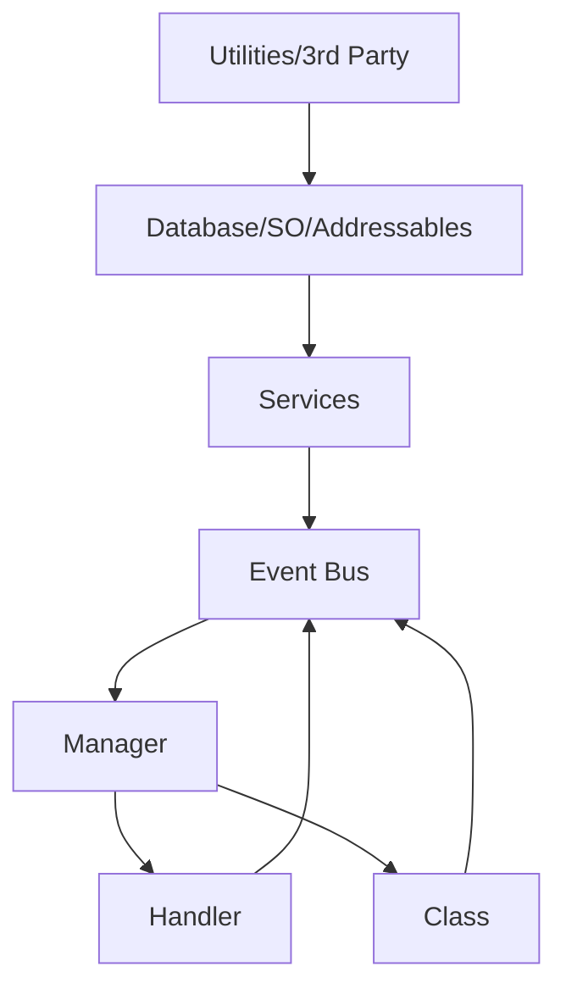

# Capriccioso Starter Package


A comprehensive Unity starter package providing core systems for game development: singletons, service locator, event bus, object pooling, timers, and more.

## Quick Start

### 1. Create a Bootstrap Scene

Create a new scene called `Bootstrap` and set it as the first scene in Build Settings. Add a `BootstrapLoader` component to an empty GameObject:

```csharp
using Capriccioso.Runtime.Bootstrap;
using Capriccioso.Runtime.Core;
using Capriccioso.Runtime.Events;
using Capriccioso.Runtime.Logging;
using UnityEngine;
using UnityEngine.SceneManagement;

public class GameBootstrapper : MonoBehaviour
{
    [SerializeField] private string _firstGameScene = "MainMenu";
    
    private void Awake()
    {
        CLogger.LogMajorAction("Game Starting...");
        
        // Register core services
        RegisterServices();
        
        // Subscribe to global events
        SubscribeToEvents();
        
        // Load the first game scene
        SceneManager.LoadScene(_firstGameScene);
    }
    
    private void RegisterServices()
    {
        // Register interface-based services with ServiceLocator
        ServiceLocator.Register<IAudioService>(new AudioService());
        ServiceLocator.Register<ISaveService>(new SaveService());
        
        CLogger.LogSuccess("Services registered");
    }
    
    private void SubscribeToEvents()
    {
        // Use auto-dispose pattern for safe event handling
        EventBus.Subscribe<PlayerDeathEvent>(OnPlayerDeath);
        EventBus.Subscribe<LevelCompleteEvent>(OnLevelComplete);
        
        CLogger.LogSuccess("Events subscribed");
    }
    
    private void OnPlayerDeath(PlayerDeathEvent evt)
    {
        CLogger.LogEvent($"Player died at position {evt.Position}");
    }
    
    private void OnLevelComplete(LevelCompleteEvent evt)
    {
        CLogger.LogSuccess($"Level {evt.LevelIndex} complete!");
    }
}
```

### 2. Create a Service (MonoSingleton Pattern)

```csharp
using Capriccioso.Runtime.Core;
using Capriccioso.Runtime.Logging;

public class GameManager : MonoSingleton<GameManager>
{
    public int Score { get; private set; }
    
    protected override void Awake()
    {
        base.Awake();
        CLogger.LogInfo("GameManager initialized");
    }
    
    public void AddScore(int points)
    {
        Score += points;
        EventBus.Publish(new ScoreChangedEvent(Score));
    }
}
```

### 3. Define Events

```csharp
using Capriccioso.Runtime.Events;
using UnityEngine;

public struct PlayerDeathEvent : IEvent
{
    public Vector3 Position { get; }
    
    public PlayerDeathEvent(Vector3 position)
    {
        Position = position;
    }
}

public struct ScoreChangedEvent : IEvent
{
    public int NewScore { get; }
    
    public ScoreChangedEvent(int score)
    {
        NewScore = score;
    }
}
```

### 4. Use Object Pooling

```csharp
using Capriccioso.Runtime.Pooling;
using UnityEngine;

public class BulletSpawner : MonoBehaviour
{
    [SerializeField] private GameObject _bulletPrefab;
    private GameObjectPool _bulletPool;
    
    private void Start()
    {
        _bulletPool = new GameObjectPool(_bulletPrefab, initialSize: 20);
    }
    
    public void FireBullet(Vector3 position, Vector3 direction)
    {
        GameObject bullet = _bulletPool.Get();
        bullet.transform.position = position;
        bullet.GetComponent<Bullet>().Fire(direction);
    }
    
    public void ReturnBullet(GameObject bullet)
    {
        _bulletPool.Release(bullet);
    }
}
```

### 5. Use Timers and Cooldowns

```csharp
using Capriccioso.Runtime.Timing;
using UnityEngine;

public class AbilitySystem : MonoBehaviour
{
    private Cooldown _dashCooldown;
    private Timer _buffTimer;
    
    private void Start()
    {
        _dashCooldown = new Cooldown(2f);
        _buffTimer = new Timer(10f, onComplete: () => RemoveBuff());
    }
    
    private void Update()
    {
        _dashCooldown.Tick(Time.deltaTime);
        _buffTimer.Tick(Time.deltaTime);
    }
    
    public void TryDash()
    {
        if (_dashCooldown.IsReady)
        {
            PerformDash();
            _dashCooldown.Use();
        }
    }
    
    public void ApplyBuff()
    {
        _buffTimer.Start();
    }
}
```

---

## Package Systems

| System | Namespace | Description |
|--------|-----------|-------------|
| **MonoSingleton** | `Capriccioso.Runtime.Core` | Thread-safe singleton base class |
| **ServiceLocator** | `Capriccioso.Runtime.Core` | Interface-based dependency injection |
| **EventBus** | `Capriccioso.Runtime.Events` | Decoupled pub/sub messaging with auto-dispose |
| **GameEvent** | `Capriccioso.Runtime.Events` | ScriptableObject-based events |
| **ObjectPool** | `Capriccioso.Runtime.Pooling` | GameObject and object pooling with IPoolable |
| **Timer/Cooldown** | `Capriccioso.Runtime.Timing` | Lightweight timing utilities |
| **BrokerChain** | `Capriccioso.Runtime.Pipeline` | Chain of Responsibility pattern |
| **CLogger** | `Capriccioso.Runtime.Logging` | Colored console logging |
| **Extensions** | `Capriccioso.Runtime.Extensions` | Vector, Transform, Collection helpers |

---

## Documentation

- [Code Standards](Documentation~/CODE_STANDARDS.md) - Style guidelines, logging practices
- [Contributing](Documentation~/CONTRIBUTING.md) - Branch workflow, versioning

See individual `readme.md` files in each Runtime folder for detailed system documentation.

---

# Code Architecture

This document outlines the architectural design pattern for Unity projects at Capriccioso Game Studio, enforcing separation of concerns and maintainability.  

## Core Layers  
  

### 1. Utilities / 3rd Party Libraries  
**Access**: Global  
**Purpose**: Reusable tools and external libraries.  
**Examples**:  
- JSON serializers (Newtonsoft JSON)  
- Math utilities  
- Extension methods  
**Rules**:  
- Must contain zero game logic  
- Stateless implementations only  

**Read More**:  
[Unity Utility Design Patterns](https://unity.com/how-to/architect-game-code) • [Third-Party Integration Best Practices](https://learn.unity.com/tutorial/working-with-third-party-tools)  

---

### 2. Database / Scriptable Objects / Addressables  
**Access**: Services layer only 🔒  
**Purpose**: Data storage and asset management.  
**Examples**:  
- Firebase/Firestore databases  
- ScriptableObject assets (e.g. `OutfitConfig.asset`)  
- Addressable assets  
**Rules**:  
- No direct access from UI or gameplay code  
- All access must go through Services  

**Read More**:  
[ScriptableObject Workflow](https://youtu.be/raQ3iHhE_Kk) • [Addressables System](https://docs.unity3d.com/Packages/com.unity.addressables@1.19/manual/index.html) • [Firebase Unity SDK](https://firebase.google.com/docs/unity/setup)  

---

### 3. Services  
**Access**: Event Bus, Managers, Handlers, Classes  
**Implementation**: `MonoSingleton` pattern  
**Purpose**: Stateless "backend" logic layer.  
**Examples**:  
- `FirebaseService`  
- `InventoryService`  
- `AnalyticsService`  
**Rules**:  
- ✅ Stateless  
- ✅ Singleton access point  
- ❌ No inspector references  
- ❌ No persistent data storage  
- ❌ Never call Managers/Handlers  

**Read More**:  
[Service Locator Pattern](https://gameprogrammingpatterns.com/service-locator.html) • [Singleton in Unity](https://learn.unity.com/tutorial/implement-data-persistence-between-scenes#)  

---

### 4. Event Bus  
**Access**: All layers (primary communication channel)  
**Purpose**: Decoupled event messaging system.  
**Examples**:  
- `PlayerEvents.OnHealthChanged`  
- `UIEvents.OnInventoryOpened`  
**Rules**:  
- Managers subscribe to events  
- Handlers/Classes trigger events  
- Avoid complex payloads  

**Read More**:  
[Observer Pattern](https://refactoring.guru/design-patterns/observer) • [Unity Event Architectures](https://www.youtube.com/watch?v=gx0Lt4tCDE0)  

---

### 5. Manager  
**Access**: Handlers/Classes → Managers (never reverse)  
**Location**: "Manager" GameObject in scene  
**Purpose**: State coordination across systems.  
**Examples**:  
- `UIManager` (controls UIHandlers)  
- `PlayerManager` (tracks player classes)  
- `GameStateManager`  
**Rules**:  
- May reference Handlers  
- Never call Services directly (use Events)  

---

### 6. Handler  
**Access**: Called by Managers  
**Implementation**: `MonoBehaviour` with inspector references  
**Purpose**: Visual/audio element controller.  
**Examples**:  
- `InventoryHandler` (UI panels with Canvas refs)  
- `AudioHandler` (AudioSource controllers)  
**Rules**:  
- ❌ No business logic  
- ✅ Inspector-configurable  

---

### 7. Class  
**Access**: Similar to Handler  
**Purpose**: Data containers and pure logic.  
**Examples**:  
- `PlayerClass` (health/stats)  
- `InventoryItem` (data model)  
- `AchievementSystem` (logic processor)  
**Rules**:  
- Minimal Unity dependencies  
- Serializable data structures  

---

## Access Flow Diagram  


## Prohibited Access Patterns  
```csharp
// ❌ BAD - Service calling Manager
class AchievementService : MonoSingleton<AchievementService> 
{
    void GrantAchievement() 
    {
        UIManager.Instance.ShowPopup(); // ILLEGAL
    }
}

// ✅ GOOD - Using Event Bus
class AchievementService : MonoSingleton<AchievementService>
{
    void GrantAchievement()
    {
        EventBus.Publish(new AchievementUnlockedEvent());
    }
}
```

## Recommended Folder Structure  
```
Scripts/
├── 3rdParty/
├── Database/
│   ├── ScriptableObjects/
│   └── Addressables/
├── Services/
├── Events/
├── Managers/
├── Handlers/
└── Classes/
```

**Learn More**:  
[Unity Architecture Guide](https://github.com/UnityCommunity/UnityLibrary) • [Game Programming Patterns](https://gameprogrammingpatterns.com/)
