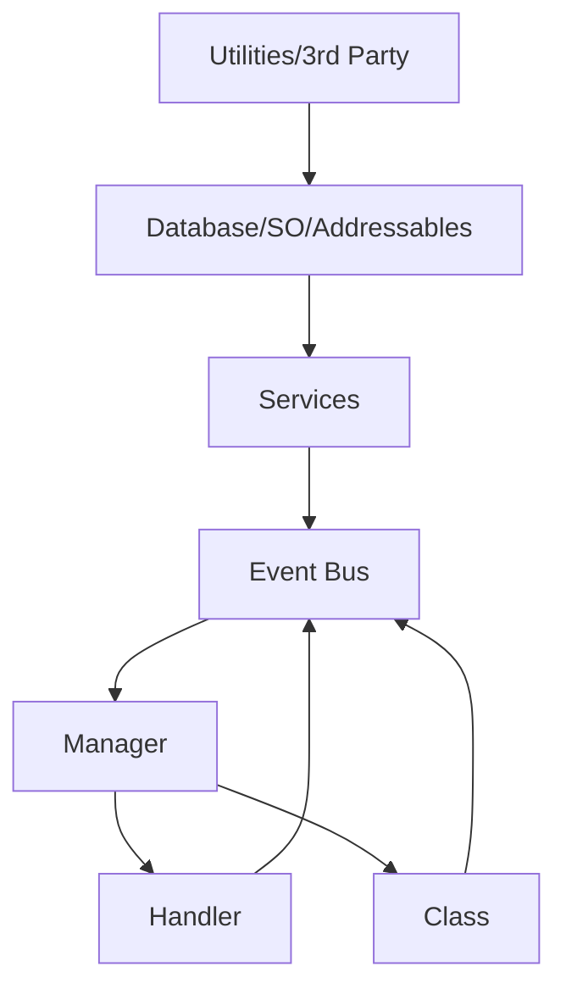

# capriccioso-package


# Capriccioso Game Studio - Unity Code Structure  

This document outlines the architectural design pattern for Unity projects at Capriccioso Game Studio, enforcing separation of concerns and maintainability.  

## Core Layers  
  

### 1. Utilities / 3rd Party Libraries  
**Access**: Global  
**Purpose**: Reusable tools and external libraries.  
**Examples**:  
- JSON serializers (Newtonsoft JSON)  
- Math utilities  
- Extension methods  
**Rules**:  
- Must contain zero game logic  
- Stateless implementations only  

**Read More**:  
[Unity Utility Design Patterns](https://unity.com/how-to/architect-game-code) • [Third-Party Integration Best Practices](https://learn.unity.com/tutorial/working-with-third-party-tools)  

---

### 2. Database / Scriptable Objects / Addressables  
**Access**: Services layer only 🔒  
**Purpose**: Data storage and asset management.  
**Examples**:  
- Firebase/Firestore databases  
- ScriptableObject assets (e.g. `OutfitConfig.asset`)  
- Addressable assets  
**Rules**:  
- No direct access from UI or gameplay code  
- All access must go through Services  

**Read More**:  
[ScriptableObject Workflow](https://youtu.be/raQ3iHhE_Kk) • [Addressables System](https://docs.unity3d.com/Packages/com.unity.addressables@1.19/manual/index.html) • [Firebase Unity SDK](https://firebase.google.com/docs/unity/setup)  

---

### 3. Services  
**Access**: Event Bus, Managers, Handlers, Classes  
**Implementation**: `MonoSingleton` pattern  
**Purpose**: Stateless "backend" logic layer.  
**Examples**:  
- `FirebaseService`  
- `InventoryService`  
- `AnalyticsService`  
**Rules**:  
- ✅ Stateless  
- ✅ Singleton access point  
- ❌ No inspector references  
- ❌ No persistent data storage  
- ❌ Never call Managers/Handlers  

**Read More**:  
[Service Locator Pattern](https://gameprogrammingpatterns.com/service-locator.html) • [Singleton in Unity](https://learn.unity.com/tutorial/implement-data-persistence-between-scenes#)  

---

### 4. Event Bus  
**Access**: All layers (primary communication channel)  
**Purpose**: Decoupled event messaging system.  
**Examples**:  
- `PlayerEvents.OnHealthChanged`  
- `UIEvents.OnInventoryOpened`  
**Rules**:  
- Managers subscribe to events  
- Handlers/Classes trigger events  
- Avoid complex payloads  

**Read More**:  
[Observer Pattern](https://refactoring.guru/design-patterns/observer) • [Unity Event Architectures](https://www.youtube.com/watch?v=gx0Lt4tCDE0)  

---

### 5. Manager  
**Access**: Handlers/Classes → Managers (never reverse)  
**Location**: "Manager" GameObject in scene  
**Purpose**: State coordination across systems.  
**Examples**:  
- `UIManager` (controls UIHandlers)  
- `PlayerManager` (tracks player classes)  
- `GameStateManager`  
**Rules**:  
- May reference Handlers  
- Never call Services directly (use Events)  

---

### 6. Handler  
**Access**: Called by Managers  
**Implementation**: `MonoBehaviour` with inspector references  
**Purpose**: Visual/audio element controller.  
**Examples**:  
- `InventoryHandler` (UI panels with Canvas refs)  
- `AudioHandler` (AudioSource controllers)  
**Rules**:  
- ❌ No business logic  
- ✅ Inspector-configurable  

---

### 7. Class  
**Access**: Similar to Handler  
**Purpose**: Data containers and pure logic.  
**Examples**:  
- `PlayerClass` (health/stats)  
- `InventoryItem` (data model)  
- `AchievementSystem` (logic processor)  
**Rules**:  
- Minimal Unity dependencies  
- Serializable data structures  

---

## Access Flow Diagram  


## Prohibited Access Patterns  
```csharp
// ❌ BAD - Service calling Manager
class AchievementService : MonoSingleton<AchievementService> 
{
    void GrantAchievement() 
    {
        UIManager.Instance.ShowPopup(); // ILLEGAL
    }
}

// ✅ GOOD - Using Event Bus
class AchievementService : MonoSingleton<AchievementService>
{
    void GrantAchievement()
    {
        EventBus.Publish(new AchievementUnlockedEvent());
    }
}
```

## Recommended Folder Structure  
```
Scripts/
├── 3rdParty/
├── Database/
│   ├── ScriptableObjects/
│   └── Addressables/
├── Services/
├── Events/
├── Managers/
├── Handlers/
└── Classes/
```

**Learn More**:  
[Unity Architecture Guide](https://github.com/UnityCommunity/UnityLibrary) • [Game Programming Patterns](https://gameprogrammingpatterns.com/)
